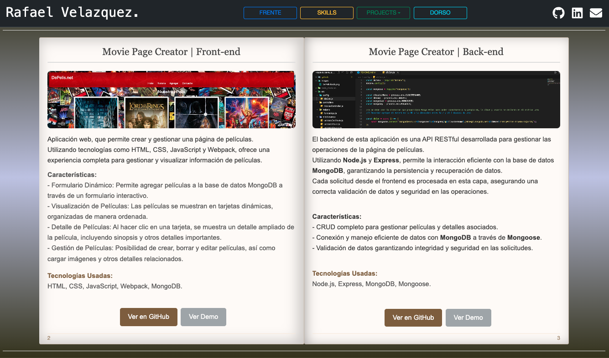

<hr>
<br>
<p align="center">
  
</p>

### <font color='lime'><p align="center"> Gracias por tu visita!! </p></font>

<hr>
<br>

# VitualBook.

### Descripción
- Proyecto creado para representar un portafolio personal que simula un libro real.
- Se podría usar para generar libros electrónicos dinámicos y realistas.

#### Tecnologías utilizadas

- React
- Librerías: framer-motion, react-pageflip

#### Para probarlo

1. Clona el repositorio:

    ```bash
   git clone git@github.com:rvh2776/VirtualBook.git
   cd VirtualBook
    ```

2. Instala las dependencias:

    ```bash
    npm install
    # o
    yarn install
    ```

4. Inicia la aplicación:

    ```bash
    npm run dev
    # o
    yarn dev
    ```

#### Scripts Disponibles
* **npm run dev:** Inicia la aplicación en modo de desarrollo.
* **npm run build:** Construye la aplicación para producción.
* **npm run preview:** Inicia la aplicación en modo de producción.
* **npm run lint:** Ejecuta el linter para revisar el código.

<br>

<hr>

### <font color='lime'><p align="right">Rafael V.H.</p></font>
